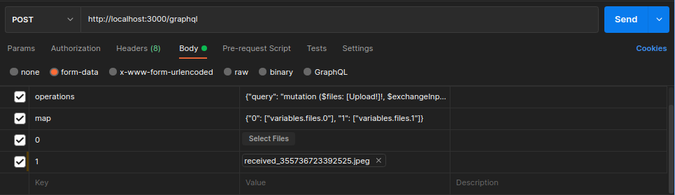
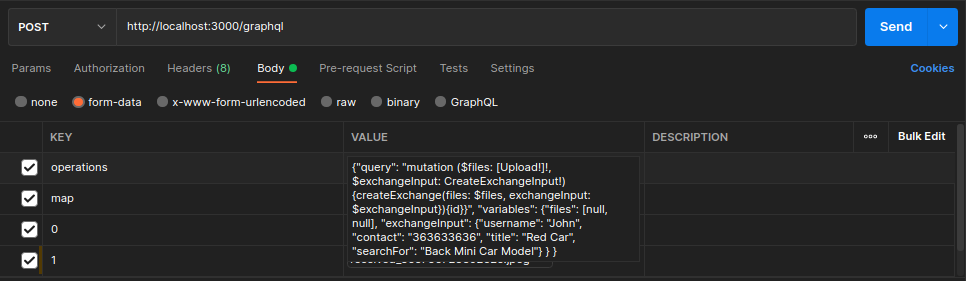

# E-fanakalo-GraphQL

## #techzara_wcc2

## A GraphQL version of E-fanakalo

* Start your PostgreSQL service and create a new database 
    ```bash
    CREATE DATABASE <your_database_name>;
    ```

* Edit .env files in your project root according to your environment
    
* In your terminal, run the following command
    ```bash
    npm install
    npm run migration:run # Create all Tables
    ```
* Create directory called "uploads" in the project root
    ```bash
    mkdir uploads
    ```

* Finally, you can run the API with the following command
    ```bash
    npm start
    ```

### The API EndPoint is http://localhost:3000/graphql
### The EndPoint for static files uploaded is http://localhost:3000/uploads

<br>

### You can view the GraphQL Schema this [link](src/schema.gql)

All valid data value for queries are the same as in the [REST version](https://github.com/Fuji-Noobie-Ghost/e-fanakalo)

* <b>sort:</b> username, title, updatedAt, createdAt
* <b>status:</b> active or deactive

<br>

> I suggest you to use [Altair GraphQL](https://altairgraphql.dev) because Altair support file uploads with his beautiful GraphQL query presentation, but you can also use Postman<br>When creating a new exchange, you need to pass picture(s) file by Form-Data. In this case, our mutation should be pass as a text in Form-Data; we all know that making GraphQL Query request in form-data body is really boring.
<br>

### This are some example of request you can test

* Get all exchanges, without pagination

    ```graphql
    query {
        exchanges (sort: "username") {
            id
            contact
            username
            createdAt
            photos {
                name
            }
        }
    }
    ```
    Sort is optional.

* Get exchanges, with the pagination system
    ```graphql
    query {
        exchangesPaginate (findInput: {
            page: 1,
            perPage: 10,
            sort: "username",
            status: "active"
        }) {
            id
            username
            title
            searchFor
            photos {
                name
            }
        }
    }
    ```
    findInput options are optionals.

* Create exchange
  * If you are using Postman, use form-data because we need to upload image(s)
    
    As you can see in this picture, GraphQL upload file in Postman is very annoying:
    1. You need to create an operation query that perform the GraphQL mutation
    
    If we try to parse the operations query string to GraphQL query, it will look like

        ```graphql
        mutation (
            $files: [Upload!]!,
            $exchangeInput: CreateExchangeInput!
        ) {
            createExchange(files: $files, exchangeInput: $exchangeInput) {
                id
            }
        }
        ```
        As variables, we have a json like

        ```json
        {
            "files": [null, null],
            "exchangeInput": {
              "username": "John", 
              "contact": "363633636",
              "title": "Red Car", 
              "searchFor": "Black Mini Car Model"
            }
        }
        ```

    2. After that, you need to map all files you want to upload as shown below
    

    3. Finally, add file according to an incremented index as key
    
        > If you want to add more file, you need to list those file in the map like shown in the picture above and insert new index that will contain your file

  * If you are using Altair, this will be pretty much simple
    
    As you can see, you just need to copy the GraphQL mutation query and variables(excluding the "files" variable) below and paste them into Altair.

* Deactivate or Activate an exchange ("N" to Deactivate and "Y" to Activate )
  ```graphql
  mutation {
    updateExchange (updateExchangeInput: {
        id: "023f3011-957c-4454-8d14-99da659ed97a",
        isActive: "N"
    }) {
        title
        isActive
        updatedAt
    }
  }
  ```

* Deleting an exchange
  ```graphql
  mutation {
    removeExchange (id: "023f3011-957c-4454-8d14-99da659ed97a")
  }
  ```

## <center>Have a nice Day :)</center>
